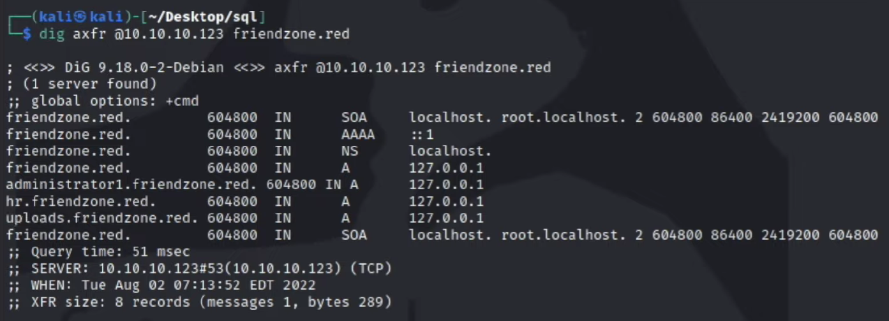

# eJPT Preparation Course - PHD Security

### Zone Transfer

```
dig axfr @10.10.10.123 friendzone.red > zone
```

<figure><figcaption></figcaption></figure>

```
cat zone | grep friendzone | grep IN | awk '{print $1}' | sort -u
```

<figure><figcaption></figcaption></figure>

### WpScan

```
 wpscan --url https://xalgord.in -e ap --plugins-detection aggressive
```

* e - enum
* ap - all plugins

